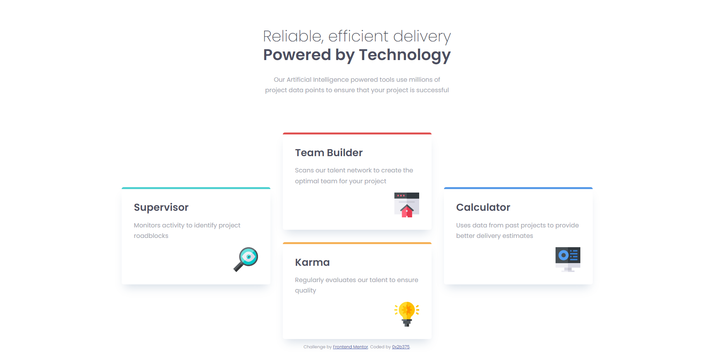

# Frontend Mentor - Four card feature section solution

This is a solution to the [Four card feature section challenge on Frontend Mentor](https://www.frontendmentor.io/challenges/four-card-feature-section-weK1eFYK).

## Table of contents

- [Overview](#overview)
  - [The challenge](#the-challenge)
  - [Screenshot](#screenshot)
  - [Links](#links)
- [My process](#my-process)
  - [Built with](#built-with)
  - [What I learned](#what-i-learned)
- [Author](#author)
- [Acknowledgments](#acknowledgments)

**Note: Delete this note and update the table of contents based on what sections you keep.**

## Overview

### The challenge

Users should be able to:

- View the optimal layout for the site depending on their device's screen size

### Screenshot



### Links

- Solution URL: [Add solution URL here](https://github.com/0x2b375/four-card-feature-section-master)
- Live Site URL: [Add live site URL here](https://0x2b375.github.io/four-card-feature-section-master/)

## My process

### Built with

- Semantic HTML5 markup
- CSS custom properties
- Flexbox
- CSS Grid

### What I learned

From this project I honed my html and css skills, 

```css
:root {
  --ff-sans: 'Poppins', sans-serif;

  --fw-light: 200;
  --fw-normal: 400;
  --fw-bold: 600;

  --fs-400: 0.9375rem;
  --fs-500: 1.25rem;
  --fs-600: 1.625rem;
  --fs-900: 2.5rem;

  --clr-neutral-900: hsl(234, 12%, 34%);
  --clr-neutral-400: hsl(229, 6%, 66%);
  --clr-neutral-100: hsl(0, 0%, 98%);

  --clr-teal: hsl(180, 58%, 56%);
  --clr-red: hsl(0, 70%, 60%);
  --clr-blue: hsl(212, 75%, 62%);
  --clr-yellow: hsl(34, 89%, 65%);
}
```


## Author

- Website - [0x2b375](https://0x2b375.github.io/four-card-feature-section-master/)
- Frontend Mentor - [@0x2b375](https://www.frontendmentor.io/profile/0x2b375)


## Acknowledgments

- I definitely couldn't do this alone, luckily I found Kevin Powell's youtube video about this problem and It was really easy to understand. If someone is having trouble with this problem highly recommend checking out his [video](https://www.youtube.com/watch?v=JFbxl_VmIx0) 


